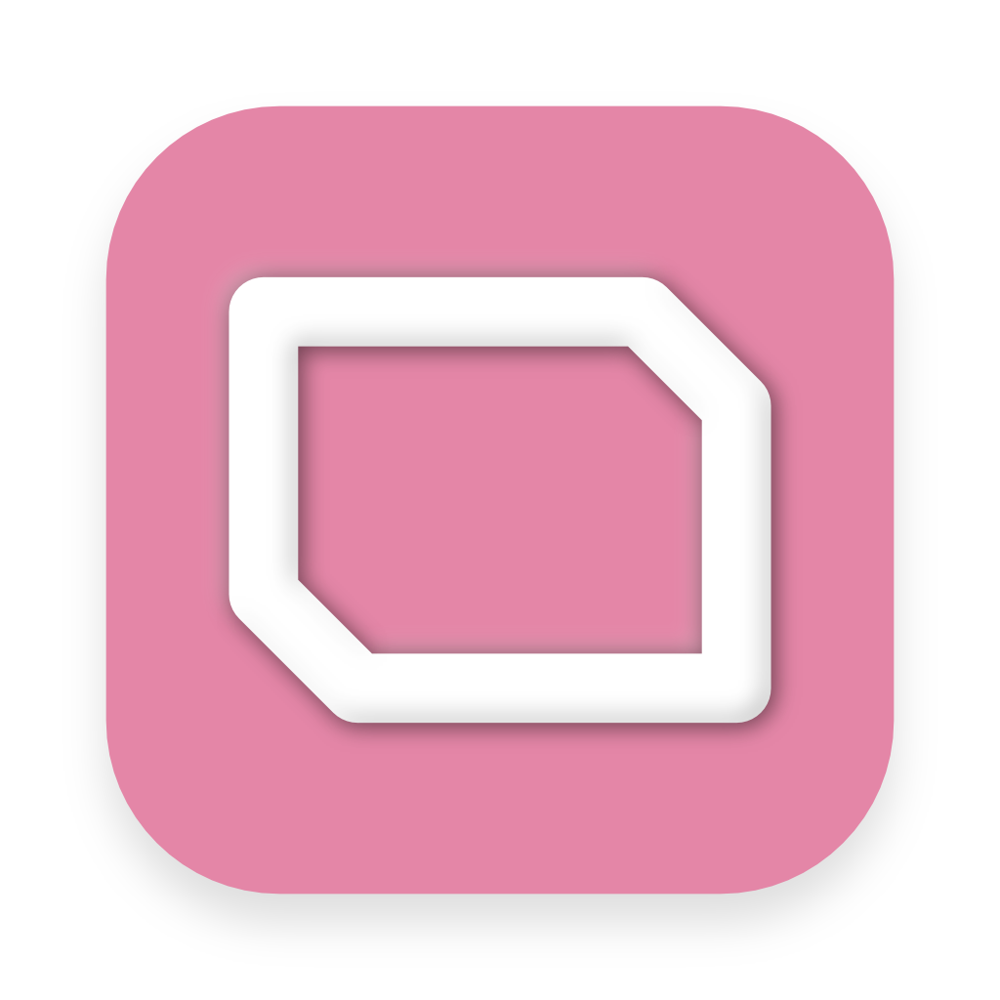

<p align="center"></p>

# 💨 Breeze

<p align="center"></p>

Look, let's be real. Task management is a pain. It all too easily turns into a black hole of wasted time. You obsess over tweaking your system, or watching productivity setups on YouTube, or configuring your Notion database _just right_, or filling in detailed metadata, or... you get the idea.

Breeze is an extremely minimal task app, built with Flutter and Dart. You have three pieces of data for each task: title, date, status (todo, wip, done). Tasks are shown in an agenda-style timeline, organized by date. That's it. Schedule tasks, update task statuses, get stuff done, reschedule as necessary. No reordering, sorting, tagging, filters, search, lists... nothing that creates extra vectors of procrastination. Try it out - you'll likely find that the extreme simplicity is a good thing.

_I personally use Breeze alongside my calendar, which I use for timeblocking and storing deadlines. The timeblocking strategy is a sound one and one that I would recommend. It gives you a better sense of how you're actually spending your day, and a more realistic estimation of what you can get done. This is more effective than just ordering your task list by priority, or setting time-based due dates (which is why Breeze has neither of these features)._

## Features

- Add and schedule tasks
- Reschedule tasks if necessary
- Set the status of a task (todo, wip, done)
- That's it.

### Build from Source

Prebuilt app packages are not yet supported. Please build from source. The Flutter SDK is required to build Breeze.

```bash
git clone git@github.com:ThatNerdSquared/breeze.git
git clone git@github.com:ThatNerdSquared/pret_a_porter.git # private dependency
cd breeze
flutter run # to run in dev mode
flutter build [platform] # platforms: macOS (verified), Windows, Linux, iOS, Android
```

If you enjoy using Breeze, and want to support barebones task management, feel free to donate below!
<a href="https://www.buymeacoffee.com/nathanyeung" target="_blank"></a>
